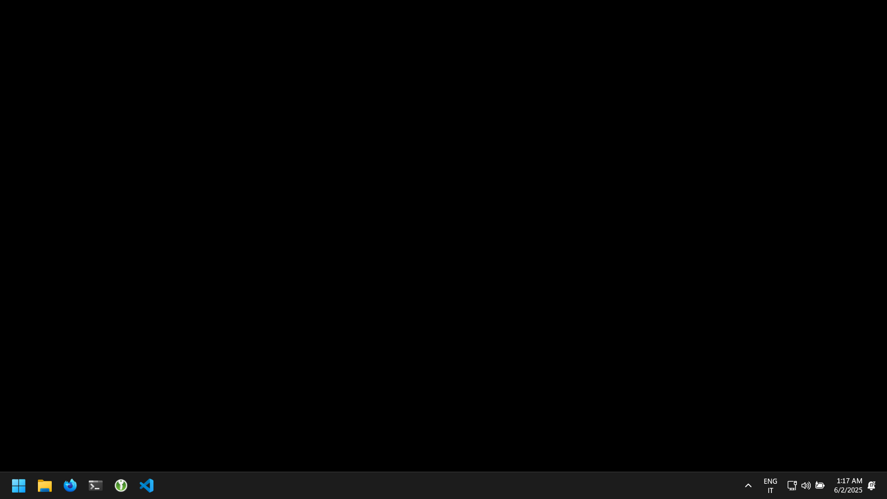
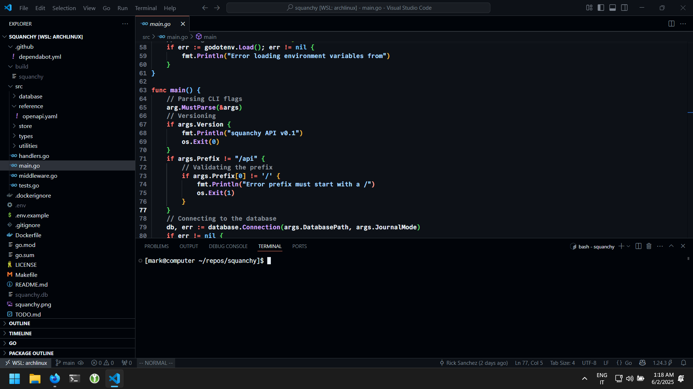
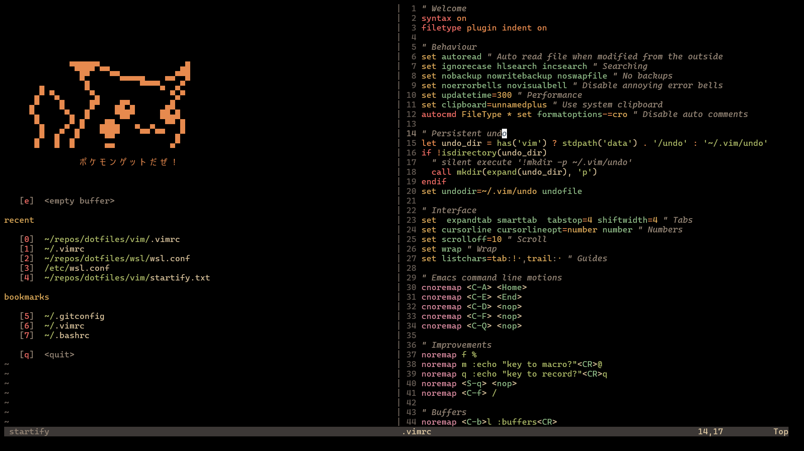

I have been using Windows and Arch Linux for a long time, as time passed I found myself comfier on Windows with WSL2.

The installation has been debloated and there's a lot I'm not showing here.

Inspired by James Scholz and setup to keep me focused during work hours and entertained when used in my free time!

