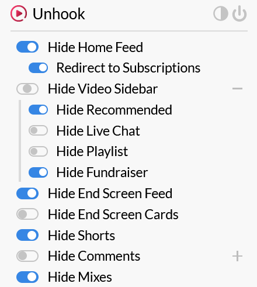

This is inspired by James Scholz and set up to keep me focused during work hours and entertained when used in my free time as I care about results and making it feel like home!

# Desktop
Doesn't look fancy I know, but does the job.


# Instructions
## Windows
1. Run https://github.com/Raphire/Win11Debloat
2. Install redistributables with https://github.com/abbodi1406/vcredist
3. Start Windows updates
4. Enable "Windows subsystem for Linux" and "Virtual Machine Platform" features
5. Change settings(no animations and useless shit)
6. Wait for Windows updates to finish
7. Restart
8. Inside Powershell "wsl.exe --install archlinux"
9. Winget install these
```
7zip.7zip
Anki.Anki
Bitwarden.Bitwarden
Discord.Discord(with Moonlight)
HTTPie.HTTPie
Microsoft.VisualStudioCode(--override "/verysilent /suppressmsgboxes /mergetasks='!runcode,addcontextmenufiles,addcontextmenufolders,associatewithfiles,addtopath'")
Mozilla.Firefox.DeveloperEdition(just to use unsigned extensions)
OBSProject.OBSStudio
Valve.Steam
VideoLan.VLC
qBittorrent.qBittorrent
x64dbg.x64dbg
```
9. Get Commit Mono or another font
10. Place the dotfiles
11. Put Steam games, cracked games and any other on the Desktop

> [!NOTE]  
> Install uBlock Origin for ads blocking and Youtube Unhook to remove shorts and stuff!

Here are my settings.



## WSL2(Arch Linux)
1. Make a new user "useradd -m -s /bin/bash NAME"
2. Install with Pacman
```
bash-completion
aria2
aws-cli 
azure-cli 
cmatrix
fd 
git
go 
gvim 
httpie
less
man-db
nodejs
pnpm
pnpm
ripgrep 
sqlite
terraform 
```
3. Install with Go
```
go install github.com/go-delve/delve/cmd/dlv@latest
go install github.com/pressly/goose/v3/cmd/goose@latest
go install github.com/ffuf/ffuf/v2@latest
go install github.com/0xsanchez/squanchy/cmd/squanchy@latest
```
3. Place the dotfiles

# Tips
New to all of this? Please take your time understanding what every package does!